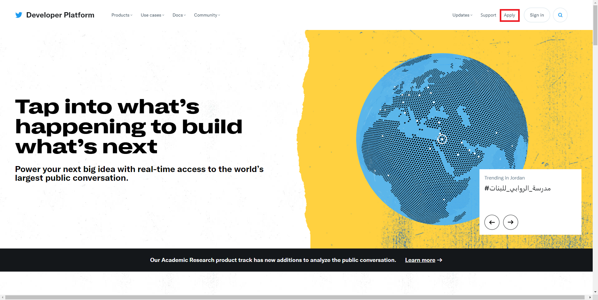
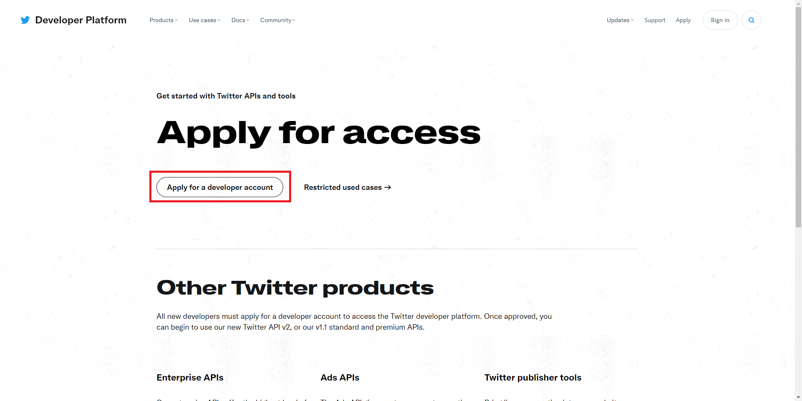

# Kawpaa

<div align="center">
  
  <p>Kawpaa is web service to assist your masturbation life.</p>
</div>

<br>

NOTE: データの登録には<a href="https://github.com/eiurur/Save-to-Kawpaa">Save-to-Kawpaa</a>の利用が必要です。

<br>

**ホスティング例**

> ~~<a href="https://kawpaa.eiurur.xyz/" target="_blank">https://kawpaa.eiurur.xyz/</a>~~

<br>

# 起動に必要なもの

- <a href="https://git-scm.com/" target="_blank">Git</a>
- <a href="https://www.docker.com/products/docker-desktop" target="_blank">Docker</a>

<br>

# 想定環境

- Windows10 Home

<br>

# 起動手順

## 0. 事前準備

Git および Docker をインストールして、git コマンドおよび docker-compose コマンドが実行できるようにしてください。

<details>
<summary>詳細</summary>

0-1. Git をインストールします(すでにインストール済みであれば作業不要です)。以下のリンクからインストーラをダウンロードしてください。

> <a href="https://git-scm.com/" target="_blank">Git</a>


<br>

0-2. ダウンロードしたインストーラを実行してインストールします。(初期設定を変更する必要は特になく Next ボタンを押下していくだけで大丈夫です)


<br>

0-3. 以下のリンクの`準備`
～`インストール`のセクションの内容を参考に Docker をインストールしてください。(すでにインストール済みであれば作業不要です)

> <a href="https://qiita.com/zaki-lknr/items/db99909ba1eb27803456" target="_blank">Windows 10 Home への Docker Desktop (ver 3.0.0) インストールが何事もなく簡単にできるようになっていた (2020.12 時点) - Qiita</a>

</details>

<br>

## 1. TwitterAPI の利用申請

以下のリンクから Twitter API の利用申請をして、`Callback URLs`の登録および`Consumer Key`と`Consumer Secret`の取得が必要です。  
もし、アプリケーションをローカルに立ち上げる場合は、申請時に`Callback URLs`の入力欄に`https://127.0.0.1:9021/auth/twitter/callback`を指定してください。

> <a href="https://developer.twitter.com/en" target="_blank">Twitter Developer Platform</a>

<details>
<summary>詳細</summary>
1-1. Twitter開発者申請を行います。

Twitter にログインした状態で下記リンク先のヘッダーの`Apply`をクリックします。

> <a href="https://developer.twitter.com/en" target="_blank">Twitter Developer Platform</a>



`Apply for a developer account`をクリックします。



`Hobbyist`を選択して、`Explorer the API`を選択し、`Get started`をクリックします。


フォームを埋めて`Next`をクリックします。


TwitterAPI と TwitterData の用途を聞かれるので英語で適当に答えます。
DeepL で英語に翻訳した文章でも通ります。自分は以下のように記入しました。

```
1. I want to provide login authentication using Twitter OAuth on the service I develop and operate.
2. I want to improve the efficiency of users by collecting and displaying tweets that match specific criteria.
```


下にスクロールすると追加で用途を聞かれますが、以下 3 つにチェックを入れて同様に英語で記入していきます。記入したら`Next`を押下します。

- `Are you planning to analyze Twitter data?`

  - I want to analyze the tweets that are popular with users that are automatically tweeted using Twitter API from my service.

- `Will you app use Tweet, Retweet, Like, Follow, or Direct Message functionally?`

  - I want to provie OAuth authenticated users with the ability to ReTweet and Like tweets displayed on my service.

- `Do you plan to display Tweets or aggregate data about Twitter content outside Twitter?`
  - I want to display to tweets that match certain criteria on my service to improve the efficiency of users.


入力内容に誤りがなければ、`Next`をクリックします。


認証待ち画面に遷移します。登録中のメールアドレスに認証用メールが送信されますのでメールの内容に従って Verify します。


Verify が完了すると承認待ちになるのでしばらく待ちます。自分の場合は数時間で承認されました。


1-2. TwitterAPI の利用申請を行います。

開発者申請承認後、開発者用ページに飛ぶとアプリ名を入力するよう指示されますので重複しない適当な名前を入力して`Get keys`を押下します。


`API Key`と`API Secret Key`が表示されるのでコピーしておきます。

本 README では、それぞれ以下のように対応しますので適宜読み替えてください。

- `API Key` ⇔ `ConsumerKey`
- `API Secret Key` ⇔ `ConsumerSecret`

`Skip to dashboard`をクリックします。


左メニューの`Project & Apps` > `Project 1` > `<先程入力したアプリ名>`をクリックします。  
`Authentication settings`の`Edit`をクリックします。


`Enable 3-legged OAuth`を有効にし、`Callback URLs`に`https://127.0.0.1:9021/auth/twitter/callback`を入力します。


画面下までスクロールし、`Save`をクリックします。


</details>

<br>

## 2. プロジェクトの clone

    $ git clone https://github.com/eiurur/Kawpaa.git
    $ cd Kawpaa

<details>
<summary>詳細</summary>

2-1. git-bash を起動してください。


<br>

2-2. プロジェクトの clone、ディレクトリの移動を行ってください。

    $ git clone https://github.com/eiurur/Kawpaa.git
    $ cd Kawpaa


</details>

<br>

## 3. 設定の変更

`.env.docker.sample`を`.env.docker`に改名します。

    $ mv .env.docker.sample .env.docker

`.env.docker`をエディタで開いて、`TW_CK`、`TW_CS`、`CALLBACK_URL`をそれぞれ ① で得られた値に変更してください。

**変更前**

```yaml
- TW_CK=<CHANGE HERE...Twitter consumer key>
- TW_CS=<CHANGE HERE...Twitter consumer secret>
- CALLBACK_URL=<CHANGE HERE...Twitter callback url>
```

**変更後(例)**

```yaml
- TW_CK=XXX1234567890ABCDEFGHIXXX
- TW_CS=ABCDEFGHIJKLMNOPQRSTUVWXYZABCDEFGHIJKLMNOPQRSTUVWX
- CALLBACK_URL=https://127.0.0.1:9021/auth/twitter/callback
```

<details>
<summary>詳細</summary>

3-1. `.env.docker.sample`を`.env.docker`に改名してください。

    $ mv .env.docker.sample .env.docker


3-2. `.env.docker`の内容のうち、`TW_CK`、`TW_CS`、`CALLBACK_URL`をそれぞれ ① で得られた値に変更してください。notepad コマンドを実行するとメモ帳が開きます。変更が終わりましたら保存してメモ帳を閉じてください。

    $ notepad .env.docker

**変更前**


**変更後(例)**


</details>

<br>

## 4. アプリケーションの起動

    $ docker-compose up -d --build

<details>
<summary>詳細</summary>

4-1. `docker-compose up -d --build`を実行してアプリケーションを起動してください。

    $ docker-compose up -d --build

**起動開始**


**起動完了後**


4-2. タスクバーの docker アイコンを右クリックして`Dashboard`メニューを左クリックし、kawpaa コンテナが立ち上がっていることを確認してください。


</details>
<br>

## 5. URL にアクセス

ブラウザを起動して <a href="https://127.0.0.1:9021/" target="_blank">https://127.0.0.1:9021/</a> にアクセスします

<details>
<summary>詳細</summary>

5-1. ブラウザを起動して`https://127.0.0.1:9021`にアクセスします。`詳細設定`>`127.0.0.1にアクセスする(安全ではありません)`をクリックしてください。Kawpaa のトップ画面が表示されたら作業完了です。


</details>
<br>

# その他

- コンテンツの登録には Chrome Extension が必要です。<a href="https://github.com/eiurur/Save-to-Kawpaa" target="_blank">こちらから</a>最新版をダウンロードしてください。
- ローカルで立ち上げず、VPS やクラウドで立ち上げる場合は、上記手順ならびにソースコードの`https://127.0.0.1:9021`を各自のドメインに置き換えてください。

  - また、<a href="https://github.com/eiurur/Save-to-Kawpaa" target="_blank">ChromeExtension</a>も同様の置き換えを行った上で再ビルドが必要ですのでご注意ください。
    <br>

# トラブルシューティング

## Q. Danbooru の画像が保存できない

A. <a href="https://danbooru.donmai.us/" target="_blank">Danbooru</a>の画像を保存するには Danbooru の API Key が必要です。

以下の手順に従って、API Key の登録をしてください。

1. <a href="https://danbooru.donmai.us/login" target="_blank">ログイン画面</a>でログインまたはユーザの登録をしてください。

2. <a href="https://danbooru.donmai.us/profile" target="_blank">ユーザ画面</a>の API Key の View リンクをクリックしてください。

3. Add ボタンから必要なパーミッションを付与した API Key を作成してください。Name は任意、IP Address は空欄。Permissions は「explore/posts:popular」「explore/posts:searches」「explore/posts:viewed」「posts:show」の 4 つを選択してください。


4. `.env.docker`の`DANBOORU_USERNAME`にログインで使用するユーザ名を、`DANBOORU_API_KEY`に API キー一覧画面の`Key`を設定してください。


5. 「4. アプリケーションの起動」の手順にしたがってアプリケーションを再起動してください。
